# API Tests using Postman

Hello,

The Trello API offers powerful functionality for developers to programmatically interact with boards, lists, and cards. As part of the QA process, I aim to develop a targeted set of tests to address key aspects of the API's functionality, security, and performance. While these tests are not exhaustive, they focus on critical areas to ensure the API behaves as expected under common and edge-case scenarios.

API Source: https://developer.atlassian.com/cloud/trello/guides/rest-api/api-introduction/#your-first-api-call \
API Documentation: https://developer.atlassian.com/cloud/trello/rest/api-group-actions/#api-group-actions \

> [!IMPORTANT]
> A Trello account is needed in order to receive your unique API authentication Key and Token.

:arrow_upper_right:	***Jump to [Script Tests](#script-tests)***

## Functionality Tests

### CRUD operations based on API documentation
:pushpin:	Few variables were defined in order to save time: apiKey, apiToken and baseUrl

***1. Get all boards request***\
Documentation link: https://developer.atlassian.com/cloud/trello/rest/api-group-boards/#api-group-boards \
Request method used: **GET** \
Parameters used: apiKey, apiToken 

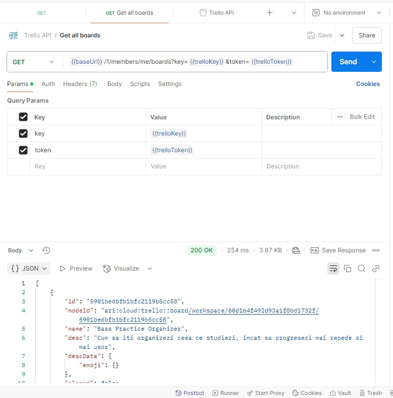

***2. Create a board***\
Documentation link: https://developer.atlassian.com/cloud/trello/rest/api-group-boards/#api-boards-post \
Request method used: **POST** \
Parameters used: apiKey, apiToken, name

**Breakdown:** *In the following request we will create a new board named New Board Github having it's unique id.*

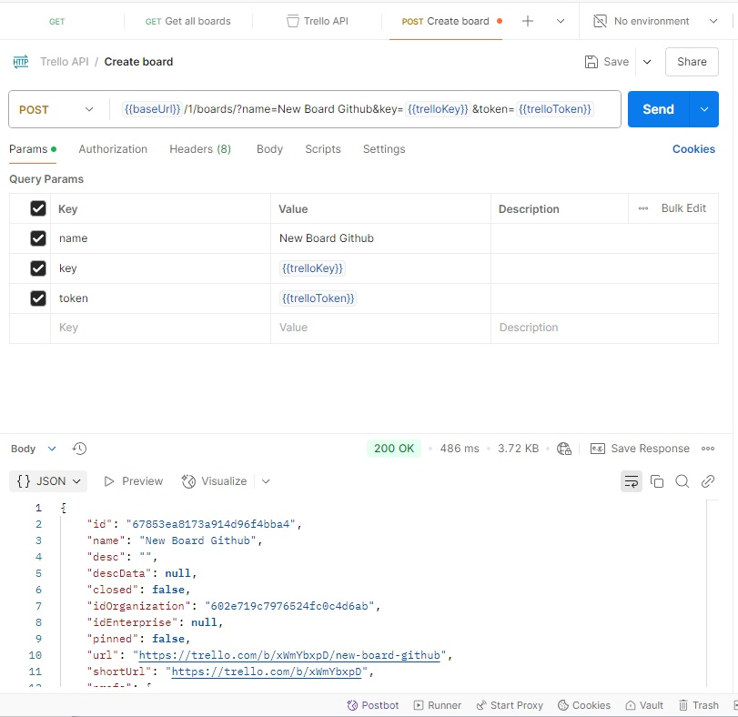

***3. Check created board***\
Documentation link: https://developer.atlassian.com/cloud/trello/rest/api-group-boards/#api-boards-id-get \
Request method used: **GET** \
Parameters used: apiKey, apiToken, id (New Board Github generated id)

**Breakdown:** *In the following request we will verify if the new board (New Board Github) has been successfully created using it's generated id* 

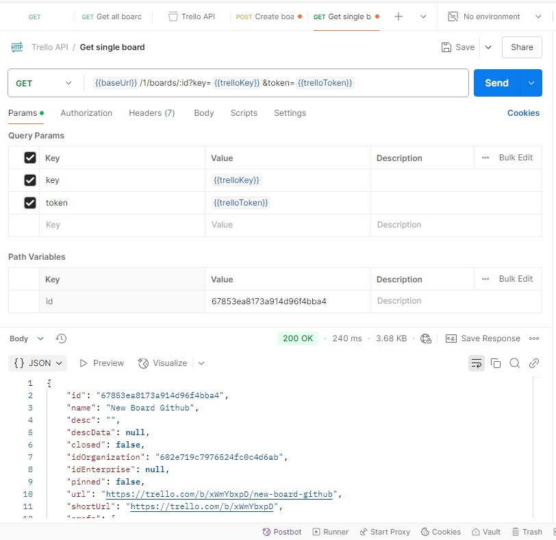

***4. Create a To Do list***\
Documentation link: https://developer.atlassian.com/cloud/trello/rest/api-group-lists/#api-lists-post \
Request method used: **POST** \
Parameters used: apiKey, apiToken, idBoard, name

**Breakdown:** *In the following request we will create a To Do List inside the board.* 

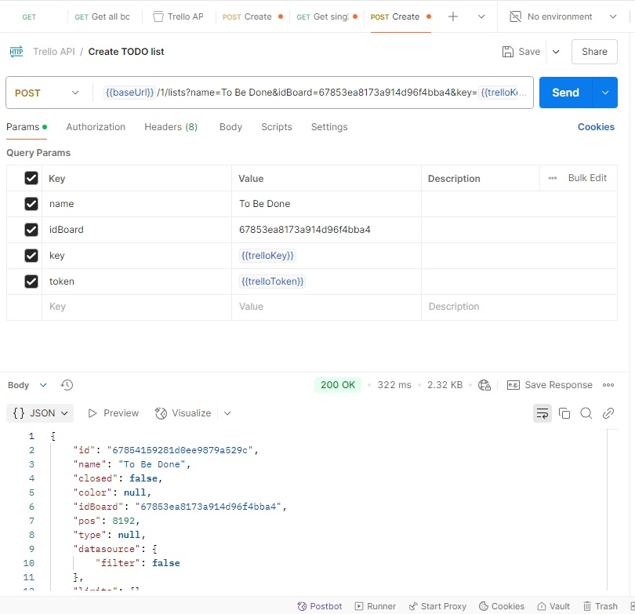

***5. Update generated list***\
Documentation link: https://developer.atlassian.com/cloud/trello/rest/api-group-lists/#api-lists-id-put \
Request method used: **PUT** \
Parameters used: apiKey, apiToken, name, pos, id(list id)

**Breakdown:** *In the following request we want to update the name and pos of the "To Do" list. New name: WorkInProgress, New Pos: 8170* 

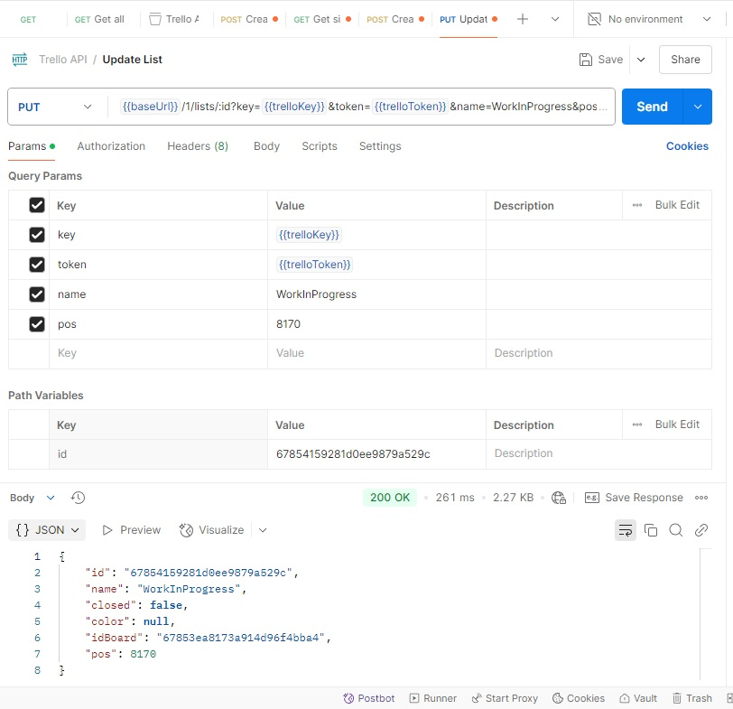

***6. Delete New Board Github***\
Documentation link: https://developer.atlassian.com/cloud/trello/rest/api-group-boards/#api-boards-id-delete \
Request method used: **Delete** \
Parameters used: apiKey, apiToken, id(board)

**Breakdown:** *In the following request we want to delete the board which we created in the first time.* 

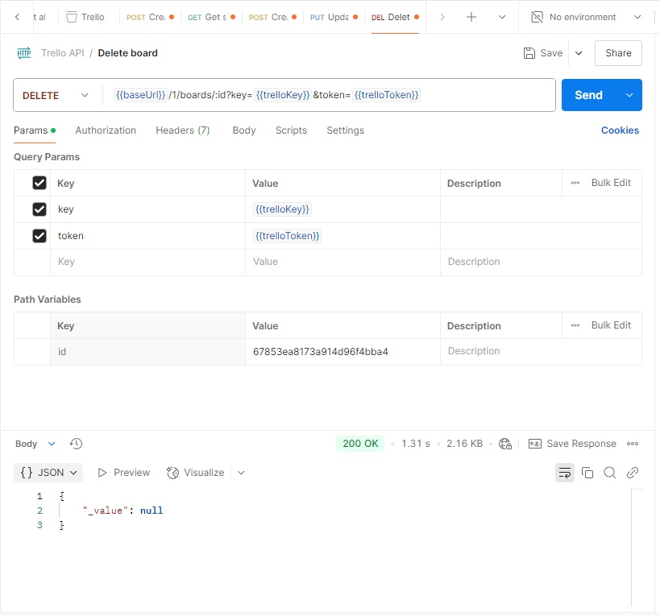

***7. Verify deleted board***\
Documentation link: https://developer.atlassian.com/cloud/trello/rest/api-group-boards/#api-boards-id-get \
Request method used: **GET** \
Parameters used: apiKey, apiToken, id(board)

**Breakdown:** *In the following request we want to check if the deleted board was indeed deleted from the database* 

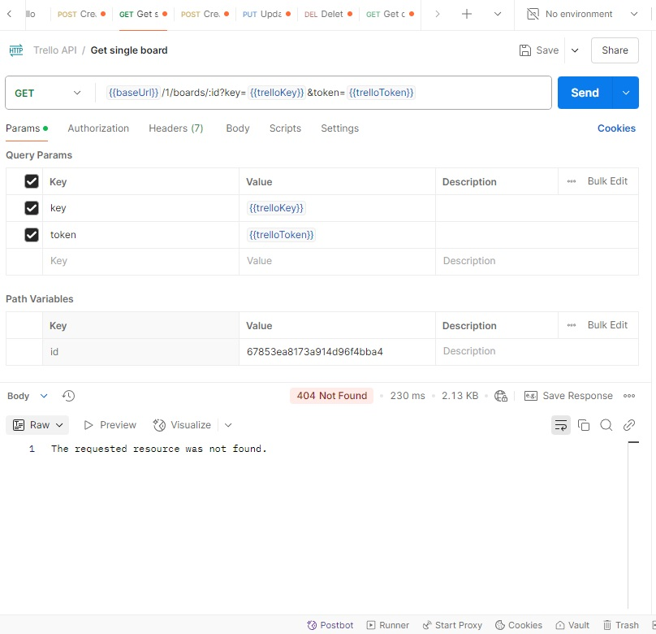

## Script Tests 

***1. Response body structure and data validation test***\
Request method used: **GET** \
Parameters used: apiKey, apiToken, id (5901bedbfb1bfc2119b5cc58)

**Breakdown:** *The following script aims to verify few body response data* 

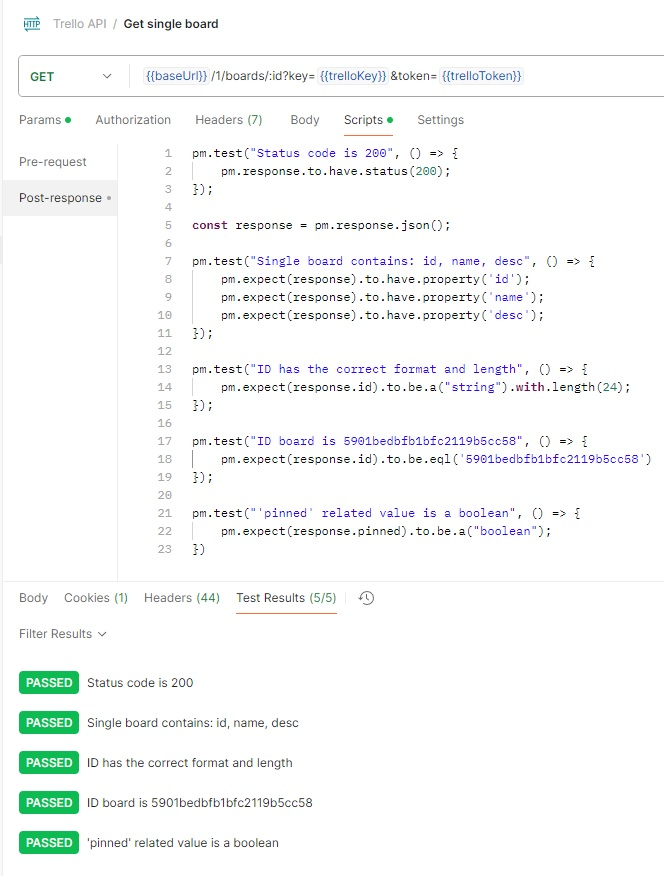 \
:page_with_curl: Body response: [Here](Postman_GIT_Screenshots/BodyResponseGetSingleBoard.json)

***2. Error handling - status code 400 - Invalid board id case***\
Request method used: **GET** \
Parameters used: apiKey, apiToken, id (random generated, non-existent)

**Breakdown:** *The following script aims to check the status code as well as the error message when the conditions are met (invalid id)* 

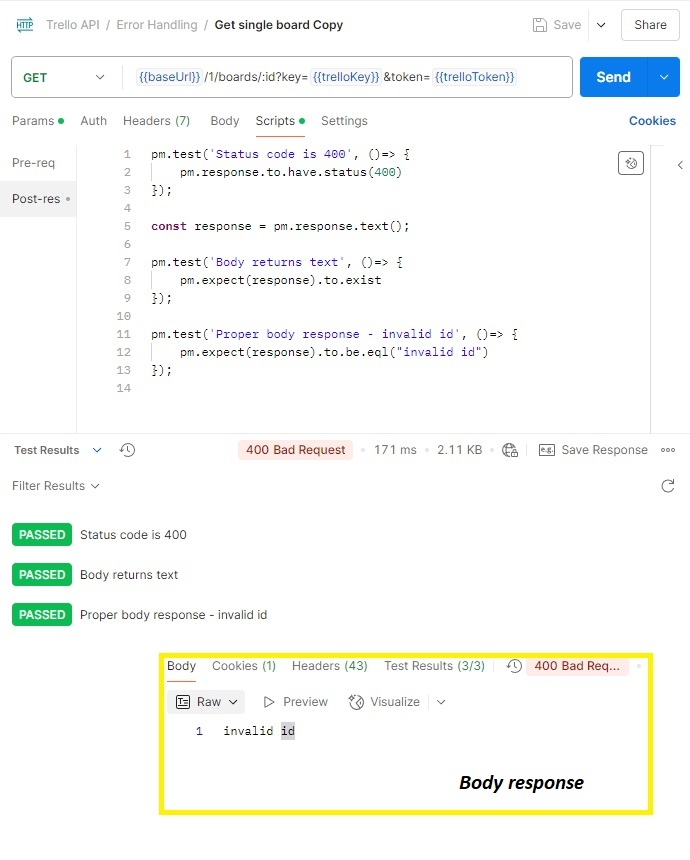 

***3. Error handling - status code 401 - Invalid Trello api key***\
Request method used: **POST** \
Parameters used: apiKey(invalid), apiToken, name 

**Breakdown:** *The following script aims to check the status code as well as the error message while using an invalid __api key__.* 

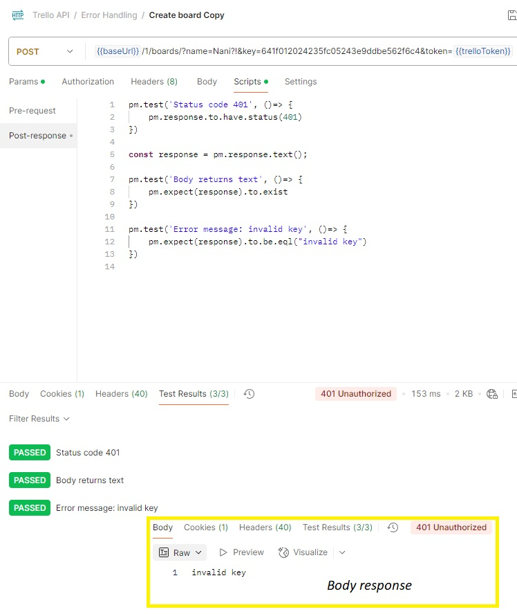 

***4. Error handling - status code 401 - Invalid Trello api Token***\
Request method used: **POST** \
Parameters used: apiKey, apiToken(invalid), name 

**Breakdown:** *The following script aims to check the status code as well as the error message while using an invalid __api token__.* 

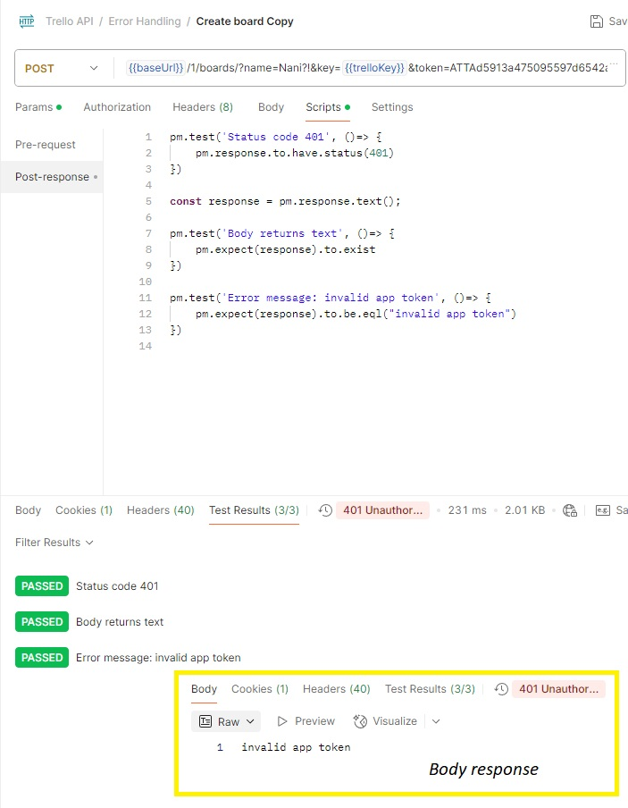 

***5. Error handling - status code 400 - Full Workspaces case***\
Request method used: **POST** \
Parameters used: apiKey, apiToken, name 

**Breakdown:** *The following script aims to check the status code as well as the error message when the workspace has reached the limit number of boards* 

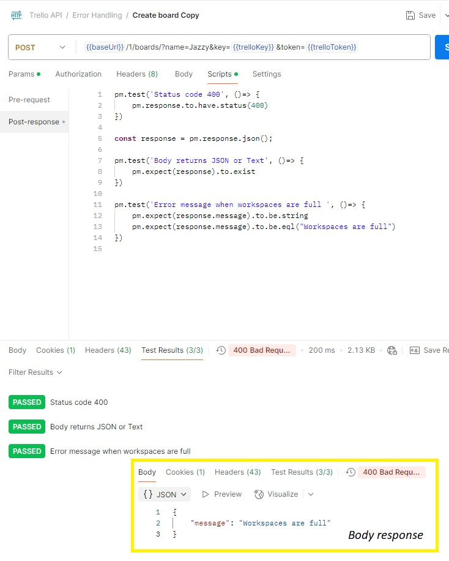 

***6. Performance - Time response test***\
Request method used: **GET** \
Parameters used: apiKey, apiToken 

**Breakdown:** *The following script aims to check the time response for an api call, in this particular case, when all boards are shown* 

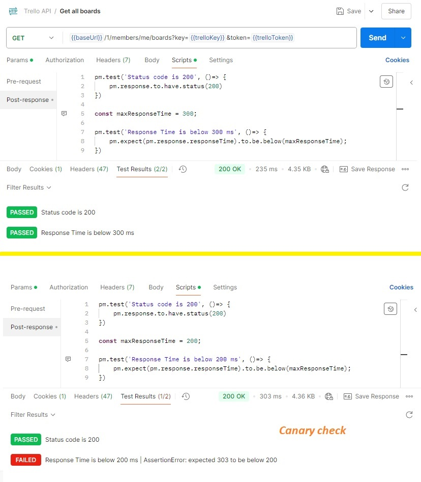 

